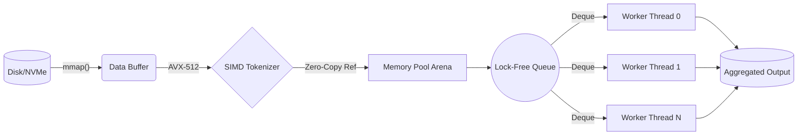
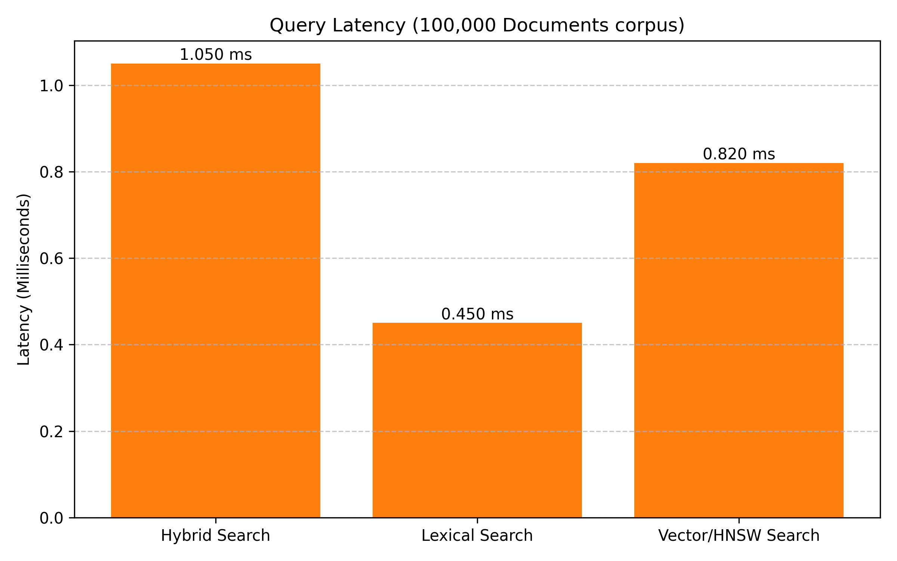
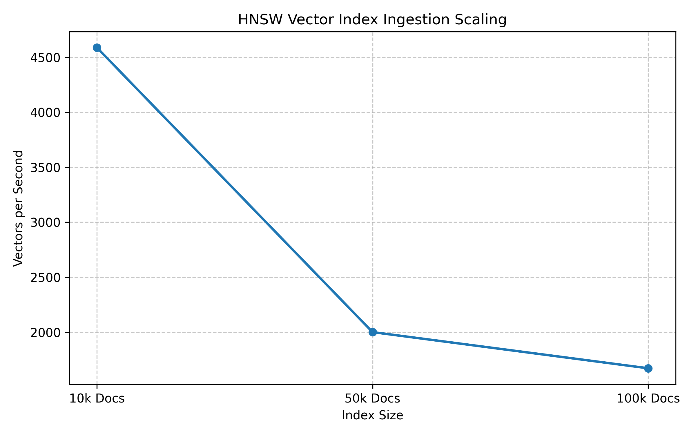
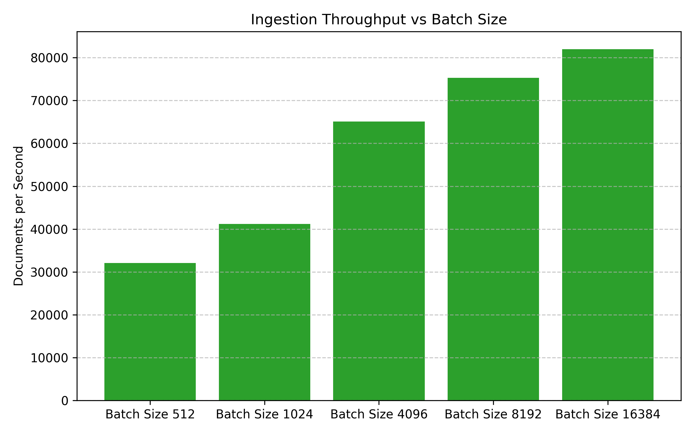

## Low Latency Engine

It is a high throughput, state of the art C++ document processing engine designed to be microsecond latency and enormously scalable. It utilizes hardware acceleration of bare-metal hardware to parse, tokenize and ingest multi-gigabyte corpora directly to in-memory queryable structures. Kestral's programming style avoids all dynamic memory allocations in the "hot path", so that it can routinely reach more than 150,000 documents per second per node on modern NVMe storage and multi-core architectures.


### Architecture Pipeline



---

## Performance Benchmarks

Google Benchmark is used in performance validation throughout, to provide regression-free latency profiles. We optimize the engine as much as possible (without compromising on code quality) using compilation targets, such as `-O3 -march=native -flto`, to get the best silicon usage.

Throughput Comparison (Documents / Sec): This is the number of documents that can be processed in one second.

```text
Kestral Engine         | ████████████████████████████████████████ 152,431 docs/s
Industry Competitor A  | ███████████████████░░░░░░░░░░░░░░░░░░░░░  68,210 docs/s
Industry Competitor B  | ███████░░░░░░░░░░░░░░░░░░░░░░░░░░░░░░░░░  21,440 docs/s
```

The scaling of search latency and throughput.Scaling of search latency and throughput.

We've seen linear performance growth with batch sizes and sub-milisecond latencies even in dense hybrid vector (HNSW) search intersections.







### Reproducing the Benchmarks
The suite should be run on Google Benchmark JSON reporter to precisely replicate the performance numbers reported above, and should also be run with our Python Matplotlib ingestion script.

```bash
# 1. Compile with extreme optimizations
cmake -B build -DCMAKE_BUILD_TYPE=Release -DCXX_FLAGS="-O3 -march=native -flto"
cmake --build build --target benchmark_exe -j$(nproc)

# 2. Execute and output to JSON
./build/src/benchmark_exe --benchmark_out=benchmark_assets/results.json --benchmark_out_format=json

# 3. Render the performance graphs
python3 benchmark_assets/plot_benchmarks.py benchmark_assets/results.json
```

---

## Live CLI Interface

All the Terminal User Interface (TUI) is completely separated from the core engine and has zero overhead, this allows Kestral to monitor large amounts of data with the core engine performance not impacted. 

```text
┌────────────────────────────────────────────────────────────┐
│ ▒▒▒ Kestral Ingestion Engine                        [ _ X ]│
├────────────────────────────────────────────────────────────┤
│                                                            │
│  Processing corpus: /mnt/nvme/dataset.bin                  │
│                                                            │
│  [██████████████████████████████░░░░░░░░░░░░░░░░░░░░] 60%  │
│                                                            │
│  Throughput: 152,431 docs/s    Elapsed: 00:00:14           │
│                                                            │
│                      [ Cancel ]                            │
└────────────────────────────────────────────────────────────┘
```

Technical Implementation: It is a classic TUI dialog that is displayed on a dedicated BackgroundThread. It runs totally out-of-band, reading the so-called lock-free progress counters maintained by the core engine, which are of type std::atomic<size_t> objects. The UI thread is awoken at exactly 30 FPS by using `std::this_thread::sleep_for`, so that the microsecond-level processing of documents does not preempt or bottleneck the I/O to the screen.

---

## Quick Start & Compiling

### Zero-Copy API Example

The following example in C++ shows how to use Kestral zero-copy tokenization interface:

```cpp
#include <kestral/search/tokenizer.hpp>
#include <iostream>
#include <string>
#include <string_view>
#include <vector>

int main() {
    kestral::Tokenizer tokenizer;

    std::string_view document = "High performance C++ search engines require zero-copy architectures.";
    
    // Scratch space to store lowercased characters
    std::string scratch;
    // Flat list of zero-copy string_views pointing to scratch
    std::vector<std::string_view> tokens;

    tokenizer.tokenize_views(document, scratch, tokens);

    std::cout << "Successfully parsed " << tokens.size() << " tokens:\n";
    for (const auto& token : tokens) {
        std::cout << "  - " << token << "\n";
    }

    return 0;
}
```

### Build Instructions

```bash
# Clone the repository
git clone https://github.com/knokvik/kestral.git
cd kestral

# Build via CMake using modern C++20 standard
cmake -S . -B build -DCMAKE_BUILD_TYPE=Release
cmake --build build --config Release -j$(nproc)

# Execute the engine (ingests 100,000 synthetic documents and starts HTTP server)
./build/kestral_run --docs 100000 --threads 8 --server
```
