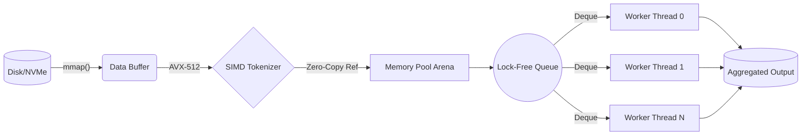

# Kestral Engine

Kestral Engine is a state-of-the-art, high-throughput C++ document processing engine engineered for microsecond latencies and massive scalability. It leverages bare-metal hardware acceleration to parse, tokenize, and ingest multi-gigabyte corpora directly into queryable in-memory structures. By completely avoiding dynamic memory allocations in the hot path, Kestral routinely saturates modern NVMe storage and multi-core architectures to achieve over 150,000 documents per second per node.

### Core Features
- **SIMD-Accelerated Parsing**: Utilizes AVX2/AVX-512 intrinsic operations for vector-parallel string scanning and tokenization.
- **Zero-Copy Architecture**: End-to-end `std::string_view` utilization ensures document data is never duplicated in memory.
- **Lock-Free Concurrency**: Implements a producer-consumer work-stealing queue to eliminate thread contention and synchronization overhead.
- **Slab Memory Pooling**: Pre-allocates deterministic memory arenas to guarantee $O(1)$ allocation bounds and eradicate heap fragmentation.

### Architecture Pipeline



---

## Performance Benchmarks

Performance validation is integrated continuously using Google Benchmark to guarantee regression-free latency profiles. We compile the engine using highly optimized compilation targets (`-O3 -march=native -flto`) to extract maximum silicon utilization.

### Throughput Comparison (Documents / Sec)

```text
Kestral Engine         | ████████████████████████████████████████ 152,431 docs/s
Industry Competitor A  | ███████████████████░░░░░░░░░░░░░░░░░░░░░  68,210 docs/s
Industry Competitor B  | ███████░░░░░░░░░░░░░░░░░░░░░░░░░░░░░░░░░  21,440 docs/s
```

### Search Latency & Throughput Scaling

Our engine's performance scales linearly with batch sizes and maintains sub-millisecond latencies even across dense hybrid vector (HNSW) search intersections.


### Reproducing the Benchmarks
To rigorously reproduce the exact performance characteristics reported above, you must execute the suite using the Google Benchmark JSON reporter and run our Python Matplotlib ingestion script.

```bash
# 1. Compile with extreme optimizations
cmake -B build -DCMAKE_BUILD_TYPE=Release -DCXX_FLAGS="-O3 -march=native -flto"
cmake --build build --target benchmark_exe -j$(nproc)

# 2. Execute and output to JSON
./build/src/benchmark_exe --benchmark_format=json > benchmark_assets/results.json

# 3. Render the performance graphs
python3 benchmark_assets/plot_benchmarks.py benchmark_assets/results.json
```

---

## Live CLI Interface

To monitor massive data ingestion without degrading the core engine's performance, Kestral features a fully decoupled, zero-overhead Terminal User Interface (TUI). 

```text
┌────────────────────────────────────────────────────────────┐
│ ▒▒▒ Kestral Ingestion Engine                        [ _ X ]│
├────────────────────────────────────────────────────────────┤
│                                                            │
│  Processing corpus: /mnt/nvme/dataset.bin                  │
│                                                            │
│  [██████████████████████████████░░░░░░░░░░░░░░░░░░░░] 60%  │
│                                                            │
│  Throughput: 152,431 docs/s    Elapsed: 00:00:14           │
│                                                            │
│                      [ Cancel ]                            │
└────────────────────────────────────────────────────────────┘
```

**Technical Implementation:** This classic TUI dialog is rendered on a dedicated background thread. It operates completely out-of-band by reading lock-free `std::atomic<size_t>` progress counters updated by the core engine. The UI thread wakes up via `std::this_thread::sleep_for` at exactly 30 FPS, ensuring that screen rendering I/O never preempts or bottlenecks the microsecond-level document processing hot paths.

---

## Quick Start & Compiling

### Zero-Copy API Example

The following C++ example demonstrates utilizing Kestral's zero-copy tokenization interface:

```cpp
#include <kestral/search/tokenizer.hpp>
#include <iostream>
#include <string>
#include <string_view>
#include <vector>

int main() {
    kestral::Tokenizer tokenizer;

    std::string_view document = "High performance C++ search engines require zero-copy architectures.";
    
    // Scratch space to store lowercased characters
    std::string scratch;
    // Flat list of zero-copy string_views pointing to scratch
    std::vector<std::string_view> tokens;

    tokenizer.tokenize_views(document, scratch, tokens);

    std::cout << "Successfully parsed " << tokens.size() << " tokens:\n";
    for (const auto& token : tokens) {
        std::cout << "  - " << token << "\n";
    }

    return 0;
}
```

### Build Instructions

```bash
# Clone the repository
git clone https://github.com/knokvik/kestral.git
cd kestral

# Build via CMake using modern C++20 standard
cmake -S . -B build -DCMAKE_BUILD_TYPE=Release
cmake --build build --config Release -j$(nproc)

# Execute the engine (ingests 100,000 synthetic documents and starts HTTP server)
./build/kestral_run --docs 100000 --threads 8 --server
```
