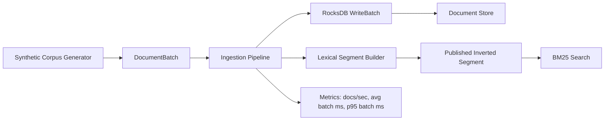

# Kestral

Kestral is a modern C++ search-systems project that is being built in public, one measurable feature at a time.

The end state is a high-throughput hybrid search engine with:

- a document ingestion path that can scale into the `100k+ docs/sec` range
- dual indexing with a compressed BM25 inverted index and a quantized vector index
- hybrid retrieval with Reciprocal Rank Fusion (RRF)
- near-real-time segment publication for fresh documents

The current codebase now covers the first two slices of that plan:

- a measured ingestion foundation
- a searchable lexical segment built with BM25 retrieval
## Current Milestone: Ingestion + Lexical Retrieval

What is implemented today:

- a readable domain model around `Document` and `DocumentBatch`
- a synthetic corpus generator that emits realistic search-oriented documents
- a batched ingestion pipeline that measures throughput and batch latency
- a RocksDB-backed storage layer using bulk writes
- a segment builder that turns batches into an immutable inverted index
- a BM25 lexical retriever with simple ranked top-k search
- unit tests plus a benchmark harness for repeatable measurement

Why this slice matters:

- it gives us a stable path to benchmark before we introduce indexing complexity
- it sets up the repo around real subsystems instead of a toy `my_library` layout
- it already includes a couple of throughput-friendly choices:
  - batched `WriteBatch` writes instead of one document per write
  - WAL disabled for the benchmark-oriented ingest path
  - pre-sized document batches and string buffers to reduce allocation churn
  - query-time postings stored in structure-of-arrays form for tighter scans
  - title terms are weighted during indexing so scoring stays simple at query time

## Architecture



## Project Layout

```text
include/kestral/core      Core document types
include/kestral/ingest    Corpus generation and ingestion pipeline
include/kestral/search    Tokenization and lexical retrieval
include/kestral/storage   RocksDB-backed document storage
src/ingest                Ingestion implementations
src/search                Tokenization and lexical index implementation
src/storage               Storage implementation
src/main.cpp              CLI demo entry point
src/benchmark.cpp         Google Benchmark harness
tests/test_main.cpp       Catch2 coverage for ingest + storage + search
```

## Build

```bash
cmake -S . -B build
cmake --build build
ctest --test-dir build --output-on-failure
```

## Run

Ingest a small corpus into a fresh local RocksDB directory:

```bash
./build/kestral_run --docs 5000 --batch-size 512 --db-path /tmp/kestral-demo-db
```

Ingest and immediately run a lexical search:

```bash
./build/kestral_run --docs 5000 --batch-size 512 --db-path /tmp/kestral-demo-db --query "vector search latency" --top-k 5
```

Run the ingestion benchmark:

```bash
./build/src/benchmark_exe --benchmark_filter='BM_LexicalSearch|BM_BatchedIngestion'
```

## Verified Snapshot

Commands run in this workspace for this milestone:

- `ctest --test-dir build --output-on-failure`
- `./build/kestral_run --docs 2000 --batch-size 256 --db-path /tmp/kestral-search-demo --query 'vector search latency' --top-k 3`
- `./build/src/benchmark_exe --benchmark_filter='BM_LexicalSearch|BM_BatchedIngestion' --benchmark_min_time=0.01s`

Sample output from the current machine:

- demo ingest + lexical search:
  - `2000 docs in 0.052s` (`38.5k docs/sec`)
  - `1 lexical segment`, `24 unique terms`
  - query `"vector search latency"` returned ranked results immediately after ingest
- benchmark ingest:
  - batch `512`: `154.0k docs/sec`
  - batch `2048`: `154.6k docs/sec`
  - batch `8192`: `147.9k docs/sec`
- benchmark lexical search:
  - `10k docs`: `0.92 ms`
  - `50k docs`: `5.69 ms`
  - `100k docs`: `8.91 ms`

These numbers are still an early snapshot, but they already show the shape we want: one pass through ingestion can both persist the document payload and publish a searchable lexical segment without rereading the corpus.

## Next Milestones

1. Replace the current in-memory postings with compressed segment storage and faster query-time intersections.
2. Add a quantized vector index and hybrid retrieval with RRF.
3. Add near-real-time multi-segment publication, soft deletes, and background merge/compaction.
4. Add controlled benchmark tables, flame graphs, and a deeper performance write-up.
